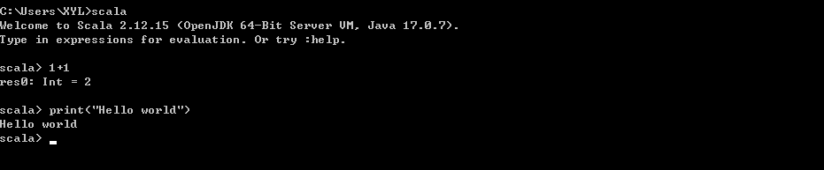
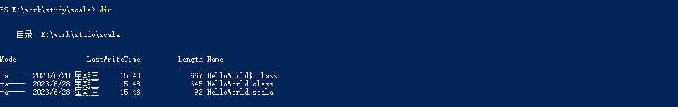

`scala`的编程方式分为交互式编程和脚本式编程

---

- **交互式编程**
> 交互式编程不需要创建脚本文件，直接在终端通过scala命令进行开发交互式编程：

```
scala

1+1
print("Hello world")
```



- **脚本式编程**
> 我们也可以创建一个`HelloWrold.scala`文件来执行代码，`HelloWorld.scala`代码如下所示：

```
object HelloWorld extends App {
    
    /**
     * 这是我的第一个Scala程序
     */
    def main(args: Array[String]) = Unit {
        print("Hello World!")
    }
}
```
接下来，我们使用`scalac`命令编译它：
```
scalac HelloWorld.scala
```
结果如下：



编译后，我们可以通过`scala`命令来执行程序：
```
scala HelloWorld
```

